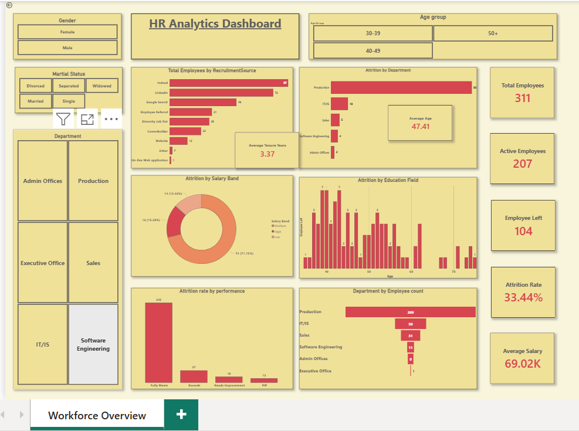

# HR Analytics Dashboard | Power BI

## Project Overview

This Power BI dashboard provides workforce analytics and HR insights by analyzing employee attrition, workforce demographics, salary distribution, recruitment effectiveness, and departmental trends. The dashboard helps HR teams monitor key workforce metrics and support data-driven decision-making.

## Business Objectives

* Monitor employee attrition trends
* Analyze workforce demographics
* Evaluate recruitment source effectiveness
* Understand salary distribution patterns
* Track department-wise workforce metrics
* Identify workforce trends and retention opportunities

## Tools & Technologies

* Power BI
* Power Query
* DAX
* Data Modeling
* Excel

## Key Metrics

* Total Employees
* Active Employees
* Attrition Rate
* Average Salary
* Department-wise Headcount
* Gender Distribution
* Recruitment Source Analysis
* Employee Performance Metrics

## Dashboard Features

* Attrition Analysis
* Department-wise Workforce Analysis
* Salary Distribution Analysis
* Gender Diversity Analysis
* Recruitment Source Performance
* Employee Demographic Insights
* Interactive Filters and Slicers
* KPI Monitoring Dashboard

## Skills Demonstrated

* Data Cleaning and Transformation
* Data Modeling
* DAX Calculations
* KPI Development
* HR Analytics
* Dashboard Design
* Data Visualization
* Business Intelligence Reporting

### Attrition Analysis

